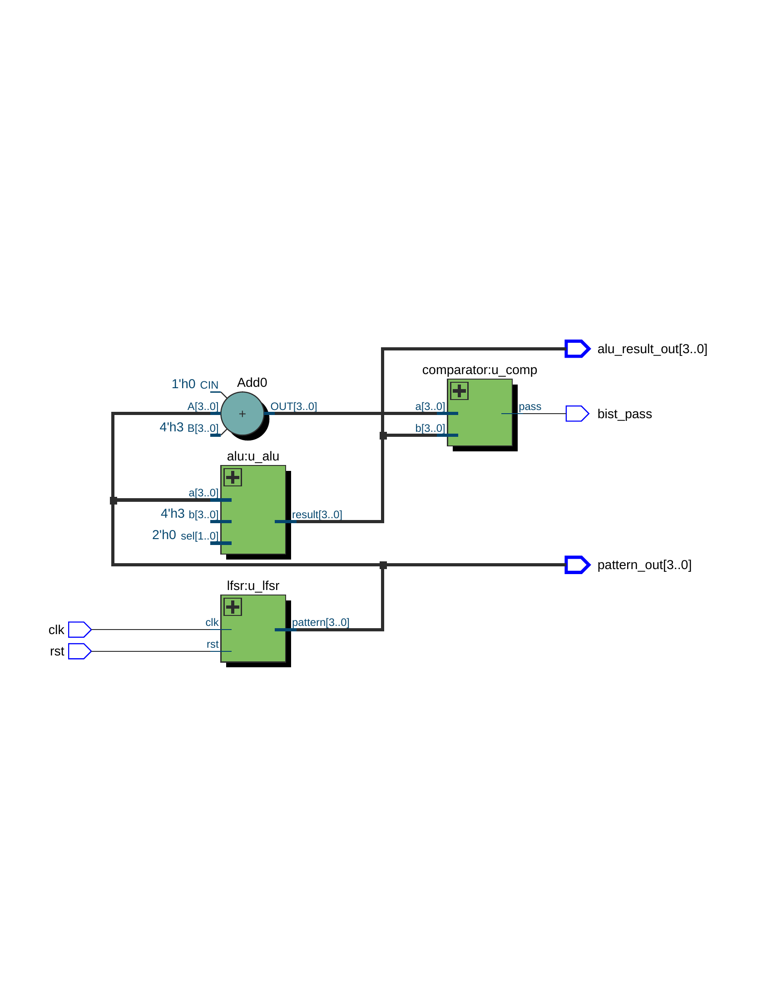
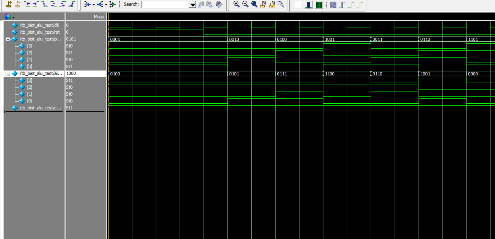

# 🔍 BIST ALU Test Project

This project implements a basic Built-In Self-Test (BIST) mechanism for a 4-bit ALU using LFSR as test pattern generator and a comparator for self-checking.

---

## 📁 Folder Structure

```
BIST_ALU_Test/
├── src/                                # 原始設計檔案
│   ├── bist_alu_test.v                 # Top-level BIST 整合模組
│   ├── alu.v                           # 4-bit ALU 被測模組
│   ├── lfsr.v                          # LFSR 測試向量產生器
│   └── comparator.v                    # 比對器模組
├── tb/                                 # 測試平台
│   └── tb_bist_alu_test.v              # Testbench 模組
├── RTL_BIST_ALU.png                    # RTL 結構圖（Quartus 匯出 .png）
├── wave_tb_bist_alu_test.png           # 波形圖（ModelSim 匯出 .png）
└── README.md                           # 本說明文件
```


---
## 🧠 RTL Schematic

Generated using Quartus RTL Viewer  

---

## 🌊 Simulation Waveform

> Waveform captured from ModelSim after `run -all`



---

## 🔧 Toolchain

- Quartus Prime Lite 18.0
- ModelSim - Intel FPGA Starter Edition 10.5b

---

## 📝 Description

- `lfsr.v`: Generates pseudo-random test patterns.
- `alu.v`: Arithmetic Logic Unit performing fixed operation.
- `comparator.v`: Checks if ALU output matches expected value.
- `bist_alu_test.v`: Top-level integration of LFSR, ALU, and comparator.
- `tb_bist_alu_test.v`: Verifies correctness of BIST integration through simulation.

---

## ✅ Result

The `bist_pass` output remains high if all test results match the expected values.
